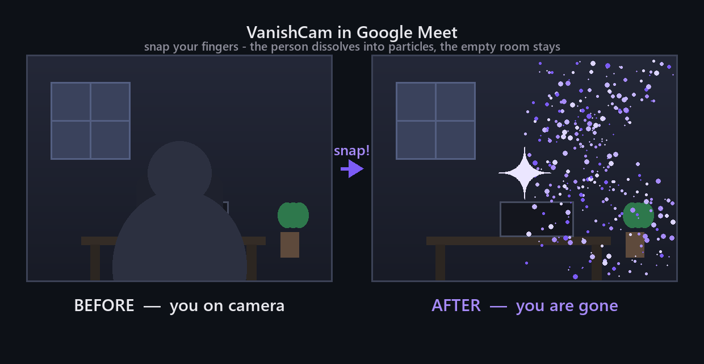

<div align="center">


# VanishCam

### Snap your fingers and vanish from your own video in Google Meet

**You stay in the call — your picture just dissolves into particles and leaves an empty room behind, until you snap again.**

<br/>

[](https://developer.chrome.com/docs/extensions/)
[](https://jojin1709.github.io/VanishCam/)
[](https://www.google.com/chrome/)
[](#privacy)
[](#privacy)
[](#privacy)
[](#license)

<br/>


&nbsp;
&nbsp;
&nbsp;
&nbsp;

<br/>

**Developed by [JOJIN JOHN](https://github.com/jojin1709)**

</div>

---

> [!TIP]
> **TL;DR:** install it, click `capture empty room`, step out of frame for 3 seconds, sit back down — then snap your fingers to disappear. Snap again to come back.
>
> **🌐 Showcase site:** [jojin1709.github.io/VanishCam](https://jojin1709.github.io/VanishCam/)

---

## See it in action

<div align="center">

**[▶ Watch the live demo](https://jojin1709.github.io/VanishCam/#demo)** — snap to vanish, snap again to return.

<br/><br/>


<br/>
<sub>Before → <b>snap!</b> → after. The left panel is you, the right panel is the empty room you captured.</sub>
</div>

The full video plays on the [showcase site](https://jojin1709.github.io/VanishCam/#demo) and is also attached to the [release](https://github.com/jojin1709/VanishCam/releases) as `hero.mp4`.

---

## Table of Contents

- [What is VanishCam?](#what-is-vanishcam)
- [See it in action](#see-it-in-action)
- [Install](#install)
- [How to use it](#how-to-use-it)
- [Settings in the panel](#settings-in-the-panel)
- [Keyboard shortcuts](#keyboard-shortcuts)
- [Troubleshooting](#troubleshooting)
- [How it works](#how-it-works)
- [Privacy](#privacy)
- [Honest scope](#honest-scope)
- [Testing](#testing)
- [License](#license)
- [Contributing](#contributing)
- [Community](#community)
- [Support](#support)

---

## What is VanishCam?

VanishCam is a tiny Chrome extension for Google Meet that makes you disappear from your own video — triggered by a normal finger snap.

- **👆 Snap to vanish** — a sharp snap dissolves your picture into particles and leaves the captured empty room behind.
- **🫥 Snap to return** — snap again and you reappear, right where you were.
- **📷 Empty-room capture** — one click takes a photo of your room while you're out of frame; that photo becomes the background you vanish into.
- **🎚 Adjustable sensitivity** — a slider tunes how hard you have to snap, so talking or knocking won't trigger it.
- **🧩 Fully local** — camera frames and microphone audio never leave your browser. No server, no account, no network calls.

It works fine offline (aside from the call itself).

---

## Install

**(3 minutes, no terminal needed)**

1. At the top of this page, click the green **`Code`** button → **`Download ZIP`**.
2. Unzip the downloaded file (just double-click it). You'll get a folder, something like `VanishCam-main`.
3. Move that folder somewhere it won't get lost, for example your `Documents` folder. Don't delete or rename the files inside it.
4. Open Chrome and go to: `chrome://extensions`.
5. Turn on **`Developer mode`** (toggle in the top right of the page).
6. Click the **`Load unpacked`** button that appears on the left, and select the folder from step 3.
7. The extension now shows up in the list. Done — open Google Meet (reload the tab if it was already open).

> [!NOTE]
> It's normal that Chrome doesn't offer a one-click install like it does for the Chrome Web Store. This is a personal extension, not published in the store, so it needs `Developer mode` to load. That's not dangerous — it's Chrome's standard way of loading extensions from outside the store.

---

## How to use it

1. Join a Meet call and allow camera and microphone access when the browser asks.
2. A small dark pill button appears in the top left. Click it, then click **`capture empty room`**.
3. Step out of frame for about 3 seconds — the extension takes a photo of the empty room.
4. Sit back down. The status will change to **`armed`**, meaning it's ready.
5. Snap your fingers (a normal, sharp snap). You'll dissolve into particles and disappear from the video. Snap again to come back.

<details>
<summary><strong>Backup triggers if the snap isn't heard</strong></summary>

- Click the **`vanish / return`** button in the panel.
- Use the shortcut **`Ctrl` + `Shift` + `X`** (`Cmd` + `Shift` + `X` on macOS).
- Hide the pill button itself while recording: **`Ctrl` + `Shift` + `H`**.

</details>

---

## Settings in the panel

Click the status text to open the panel:

| Control | What it does |
|---|---|
| `capture empty room` | takes the background photo (3-second countdown) |
| `vanish / return` | manual trigger if the snap isn't heard |
| `mic: on / off` | turns snap listening on/off and **releases the microphone** when off |
| `forget saved room` | deletes the locally stored empty-room photo |
| `snap sensitivity` | how loud a snap must be (tuned per room/mic) |
| `dissolve duration` | 0.8s – 4s dissolve/return animation |
| `particle amount` | how dense the particle cloud is (0.3x – 2x) |

All settings are stored in your browser only (`localStorage` on `meet.google.com`) — including the saved empty-room photo, so a reload doesn't force a recapture. `forget saved room` wipes it.

---

## Keyboard shortcuts

| Shortcut | Action |
|:---:|---|
| `Ctrl` + `Shift` + `X` | Vanish / return |
| `Ctrl` + `Shift` + `H` | Hide / show the pill button |

Both work **browser-wide** (even when the Meet tab isn't focused), via the Chrome
commands API. Rebind them at `chrome://extensions/shortcuts`.

---

## Troubleshooting

| Problem | Fix |
|---|---|
| **Not reacting to snaps** | Open the panel (click the status text) and move the `snap sensitivity` slider to the right (more sensitive). |
| **Triggers on its own** (talking, knocking) | Move the same slider to the left (less sensitive). |
| **The disappearing looks messy / leaves a trace** | The lighting changed since you clicked `capture empty room` — click it again right before the call. |
| **The button never shows up** | Reload the Meet tab after installing, and check that `Developer mode` is on and the extension is enabled (toggle is blue) on `chrome://extensions`. |

> [!TIP]
> Keep the camera still and the lighting steady while the extension is running, otherwise the saved "empty room" stops matching reality.

---

## How it works

```text
snap-main/
├── manifest.json    ← Manifest V3 config — runs on meet.google.com only
├── inject.js        ← content-script glue: hooks into the Meet call UI
├── snapdetect.js    ← microphone listener: detects a sharp finger snap
├── effect.js        ← particle engine: dissolves your frame into dust
└── icons/           ← app icon in 16 / 32 / 48 / 128 px
```

1. **Detect** — `snapdetect.js` listens to the microphone and watches for the sharp transient of a finger snap (tunable via the sensitivity slider). The audio is analysed in memory and never recorded.
2. **Capture** — `effect.js` stores a still photo of your empty room as the replacement background.
3. **Dissolve** — on a snap, your video frame is replaced particle-by-particle until only the empty room remains. Snap again to reverse it.

Everything runs inside the Meet tab as a content script — no background service, no network requests.

---

## Privacy

> [!IMPORTANT]
> Everything happens locally, inside your browser.

- **No video leaves your machine** — camera frames are processed in the page and never sent anywhere.
- **No audio leaves your machine** — the microphone is only used to listen for the finger snap itself; audio is never stored or recorded.
- **No server** — this extension talks to no backend, has no account, no telemetry, and no analytics.
- **Stored locally** — your settings and the captured empty-room photo live in `localStorage` on `meet.google.com` only; clear them any time with `forget saved room` (or clear site data).
- **Works offline** — aside from the Meet call itself, nothing requires an internet connection.

---

## Honest scope

| Thing | What it really does |
|---|---|
| **Snap detection** | Audio-based; may need the sensitivity slider tuned for your mic/room |
| **Empty room** | A single captured photo — lighting changes will show |
| **Works on** | Chrome 111+, Edge, Brave and other Chromium browsers (`meet.google.com` only). **Firefox is not supported** — it lacks the MAIN-world content-script API this uses. |
| **Distribution** | Loaded unpacked via `Developer mode` — not on the Chrome Web Store |

These limitations are surfaced in the UI and docs rather than hidden.

---

## Testing

Every push runs [CI](.github/workflows/ci.yml): manifest validation, file presence,
JS syntax checks and a **privacy guard** (fails the build if any extension script
gains a `fetch`, `XMLHttpRequest`, `WebSocket` or `sendBeacon` call).

```bash
node scripts/validate.js   # same checks locally
```

Manual verification checklist: **[docs/TEST_PLAN.md](docs/TEST_PLAN.md)** *(planned)*.
Manual smoke test: load unpacked → pill appears → capture room → snap → vanish →
snap → return → `forget saved room` clears it.

---

## License

> [!WARNING]
> **Not open source. Copyright (c) 2026 JOJIN JOHN — All rights reserved.**
> See [LICENSE.txt](LICENSE.txt) for the full terms.

| You can | You cannot (without permission) |
|---|---|
| Read and review the source code | Copy or re-upload this code anywhere |
| Download the official release and use it personally | Modify, rebrand, or create derivative works |
| Report bugs and suggest features | Use any part of this code in your own project |
| Fix something in a **private** fork | Publish a fork, port, or rebrand |

Permission for any use beyond personal use of the official release must be
requested in writing from the copyright holder —
[github.com/jojin1709](https://github.com/jojin1709). No response means no
permission.

Every copy, fork, and derivative of this work remains the property of
JOJIN JOHN.

---

## Contributing

Bugs and feature ideas are welcome — read
**[CONTRIBUTING.md](CONTRIBUTING.md)** first.

- 🐛 [Bug report](.github/ISSUE_TEMPLATE/bug_report.md)
- 💡 [Feature request](.github/ISSUE_TEMPLATE/feature_request.md)
- 🔃 [Pull request checklist](.github/PULL_REQUEST_TEMPLATE.md)

Pull requests are accepted case by case; never ship this code, or a
modification of it, as your own.

---

## Community

| Document | What's in it |
|---|---|
| [Code of Conduct](CODE_OF_CONDUCT.md) | the standards everyone here agrees to |
| [Contributing](CONTRIBUTING.md) | how to report, propose, and submit changes |
| [Security policy](SECURITY.md) | how to report a vulnerability **privately** |
| [Releases](https://github.com/jojin1709/VanishCam/releases) | download the latest installable ZIP |

> [!IMPORTANT]
> Security issues go through [private advisory reporting](https://github.com/jojin1709/VanishCam/security/advisories/new) — never a public issue.

---

## Support

If it saves you time, ⭐ **star the repo** — it helps others discover the project.

<div align="center">

### ❤️ Sponsor jojin1709

<a href="https://github.com/sponsors/jojin1709"></a>&nbsp;
<a href="https://github.com/sponsors/jojin1709"></a>

<br/>

<a href="https://github.com/jojin1709/VanishCam/stargazers"></a>

**Developed by JOJIN JOHN**

</div>

> **Only use this on your own camera feed and in meetings you're part of.**
